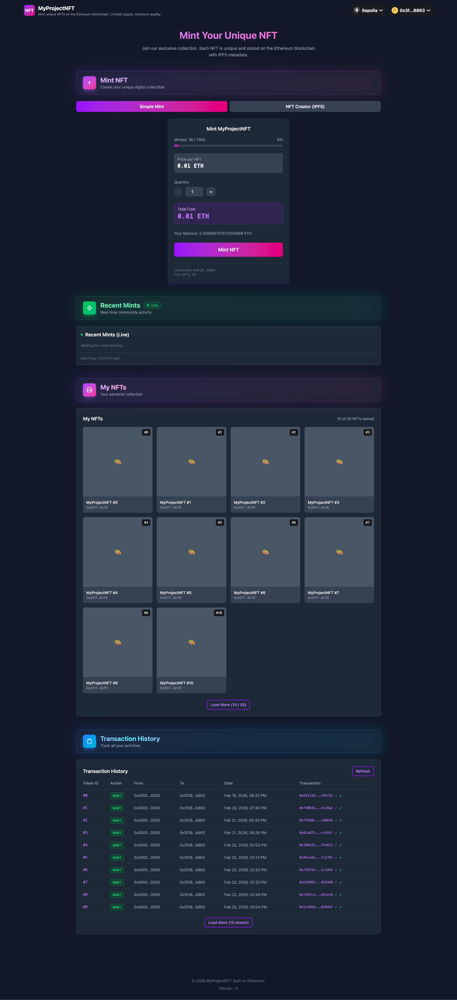
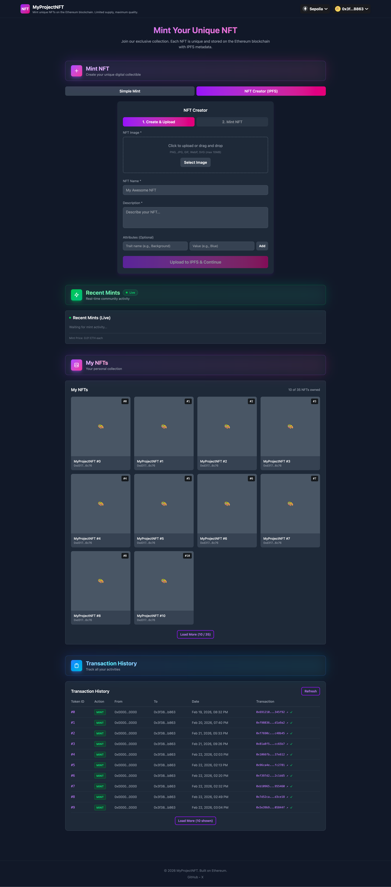

# NFT Mint DApp with Viem and Wagmi

A modern, production-ready decentralized application (DApp) for minting NFTs on the Ethereum blockchain. Built with cutting-edge Web3 technologies including **Viem**, **Wagmi v2**, **RainbowKit**, and **React 19**, backed by a Solidity smart contract compiled with Hardhat.


---

## 📸 App Preview

### 1. Simple Mint Mode

*Optimized bulk minting interface for core collections*

### 2. NFT Creator (IPFS) Mode

*1-of-1 decentralized IPFS upload and custom minting studio*

---

## ✨ Features

### Core Functionality

- 🔗 **Wallet Connection** - Seamless multi-wallet support via RainbowKit
- 🎨 **Dual Minting Modes** - Choose between optimized bulk minting ("Simple Mint") or decentralized 1-of-1 art uploads ("NFT Creator IPFS").
- 🖼️ **NFT Gallery** - View your personal NFT collection in real-time
- 📜 **Transaction History** - Track all minting activities and transactions
- 🔴 **Live Updates** - Real-time event polling for recent community mints

### Smart Contract

- 📝 **ERC721A Optimized** - Highly gas-efficient batch minting O(1) implementation using Azuki's ERC721A standard.
- 🔗 **IPFS Metadata Storage** - Custom per-token URI mapping for fully decentralized metadata hosting.
- 💰 **Mint Price Control** - Fixed mint price of 0.01 ETH.
- 📊 **Max Supply Limit** - Capped at 1,000 NFTs.
- 🔒 **Maximum Security** - Strict Checks-Effects-Interactions pattern paired with ReentrancyGuard.
- 💸 **Owner Withdrawal** - Secure fund withdrawal for contract owner.
- 🧪 **Comprehensive Tests** - Full test coverage with Hardhat + Chai.

### Technical Highlights

- ⚡ **Real-time Events** - WebSocket support for instant transaction confirmations
- 🎯 **Multi-Chain** - Support for Ethereum Mainnet and Sepolia testnet
- 🧪 **Test Coverage** - Contract tests (Hardhat) + frontend tests (Vitest)
- 🎨 **Modern UI** - Beautiful dark theme with Tailwind CSS v4
- 📱 **Responsive Design** - Mobile-first, works on all devices
- 🔐 **Type Safe** - Full TypeScript support with strict type checking

---

## 🛠️ Tech Stack

### Frontend

| Category               | Technology                     |
| ---------------------- | ------------------------------ |
| **Frontend Framework** | React 19.2.0                   |
| **Language**           | TypeScript 5.9.3               |
| **Build Tool**         | Vite 7.3.1                     |
| **Web3 Libraries**     | Viem 2.46.2, Wagmi 2.19.5      |
| **Wallet UI**          | RainbowKit 2.2.10              |
| **Styling**            | Tailwind CSS v4.2.1            |
| **State Management**   | TanStack Query 5.90.21         |
| **Notifications**      | Sonner 2.0.7                   |
| **Testing**            | Vitest 4.0.18, Testing Library |
| **Linting**            | ESLint 9.20.0, Prettier 3.8.1  |

### Smart Contract

| Category            | Technology                            |
| ------------------- | ------------------------------------- |
| **Framework**       | Hardhat 2.28.6                        |
| **Language**        | Solidity 0.8.20                       |
| **Library**         | OpenZeppelin Contracts 4.9.6, ERC721A |
| **Testing**         | Hardhat + Chai + Ethers v6            |
| **Type Generation** | TypeChain (ethers-v6)                 |

---

## 🚀 Getting Started

### Prerequisites

- **Node.js** >= 18.x
- **npm** or **yarn**
- **MetaMask** or compatible Web3 wallet
- **WalletConnect Project ID** (for RainbowKit)

### Installation

1. **Clone the repository**

   ```bash
   git clone https://github.com/yayaOnChain/nft-mint-dapp-viem-wagmi.git
   cd nft-mint-dapp-viem-wagmi
   ```

2. **Install dependencies**

   ```bash
   npm install
   ```

3. **Configure environment variables**

   Create a `.env` file in the root directory:

   ```env
   # Frontend
   VITE_WALLETCONNECT_PROJECT_ID=your_walletconnect_project_id
   VITE_USE_WEBSOCKET=true
   VITE_ALCHEMY_WS_URL=wss://eth-sepolia.g.alchemy.com/v2/your_api_key

   # Smart Contract (for Sepolia deployment)
   PRIVATE_KEY=your_private_key_here
   SEPOLIA_RPC_URL=https://ethereum-sepolia-rpc.publicnode.com
   ```

4. **Compile smart contracts**

   ```bash
   npm run compile
   ```

5. **Generate TypeChain types**

   ```bash
   npm run typechain
   ```

6. **Start development server**

   ```bash
   npm run dev
   ```

7. **Open your browser**

   Navigate to `http://localhost:5173`

---

## 📖 Available Scripts

### Frontend Scripts

| Command                   | Description                   |
| ------------------------- | ----------------------------- |
| `npm run dev`             | Start development server      |
| `npm run build`           | Build for production          |
| `npm run lint`            | Run ESLint                    |
| `npm run lint:fix`        | Auto-fix linting issues       |
| `npm run format`          | Format code with Prettier     |
| `npm run type-check`      | Run TypeScript type checking  |
| `npm run test:frontend`   | Run frontend tests (Vitest)   |
| `npm run test:watch`      | Run tests in watch mode       |
| `npm run test:ui`         | Run tests with UI             |
| `npm run test:coverage`   | Generate test coverage report |
| `npm run test:components` | Run component tests           |
| `npm run test:hooks`      | Run hook tests                |
| `npm run test:services`   | Run service tests             |
| `npm run predeploy`       | Full pre-deployment check     |

### Smart Contract Scripts

| Command                  | Description                  |
| ------------------------ | ---------------------------- |
| `npm run compile`        | Compile Solidity contracts   |
| `npm run clean`          | Clean Hardhat artifacts      |
| `npm run test:contract`  | Run contract tests (Hardhat) |
| `npm run typechain`      | Generate TypeScript types    |
| `npm run deploy:local`   | Deploy to local Hardhat node |
| `npm run deploy:sepolia` | Deploy to Sepolia testnet    |

### Full Test Suite

```bash
npm run test  # Runs both contract and frontend tests
```

---

## 🏗️ Project Structure

```
├── src/
│   ├── abi/                    # Smart contract ABIs
│   ├── assets/                 # Static assets (images, icons)
│   ├── components/             # React components
│   │   ├── nft/               # NFT-related components
│   │   │   ├── NftMinter.tsx  # Minting interface
│   │   │   ├── NftGallery.tsx # User's NFT collection
│   │   │   ├── NftCard.tsx    # Individual NFT display
│   │   │   └── RecentMints.tsx# Live community mints
│   │   ├── transaction/       # Transaction components
│   │   │   └── TransactionHistory.tsx
│   │   └── ui/                # Reusable UI components
│   ├── config/                 # App configuration
│   │   └── wagmi.ts           # Wagmi setup
│   ├── contracts/             # Smart contract source files
│   │   ├── MyNFT.sol          # ERC-721 NFT contract
│   │   └── __tests__/         # Contract tests
│   │       └── MyNFT.test.ts
│   ├── hooks/                  # Custom React hooks
│   │   ├── useNftMintedEvents.ts
│   │   ├── useNftMintedEventsPolling.ts
│   │   ├── useUserNFTHistory.ts
│   │   └── useToast.ts
│   ├── lib/                    # Utilities and constants
│   │   └── constants.ts       # App-wide configuration
│   ├── providers/              # Context providers
│   │   └── AppProviders.tsx   # Centralized provider wrapper
│   ├── scripts/                # Deployment scripts
│   │   └── deploy.ts          # Multi-network deploy script
│   ├── services/               # External service integrations
│   ├── test/                   # Test utilities
│   ├── types/                  # TypeScript type definitions
│   ├── App.tsx                 # Main application component
│   ├── main.tsx               # Entry point
│   └── index.css              # Global styles
├── hardhat.config.ts           # Hardhat configuration
├── tsconfig.json               # Root TypeScript config
├── tsconfig.app.json           # Frontend TypeScript config
├── tsconfig.hardhat.json       # Hardhat TypeScript config
├── vite.config.ts              # Vite configuration
├── vitest.config.ts            # Vitest configuration
├── contract-address-local.json # Local deployment address
├── contract-address-sepolia.json # Sepolia deployment address
└── .env                        # Environment variables
```

---

## 📝 Smart Contract

### MyNFT Contract Details

Located in `src/contracts/MyNFT.sol`:

```solidity
pragma solidity ^0.8.20;

contract MyNFT is ERC721A, Ownable, ReentrancyGuard {
    uint256 public constant MAX_SUPPLY = 1000;
    uint256 public constant MINT_PRICE = 0.01 ether;

    function mint(uint256 quantity) external payable;
    function setBaseURI(string memory baseURI) external onlyOwner;
    function setTokenURI(uint256 tokenId, string memory _tokenURI) external onlyOwner;
    function withdraw() external onlyOwner;
    function totalMinted() external view returns (uint256);
}
```

### Key Features

- **MAX_SUPPLY**: 1,000 NFTs (hard cap)
- **MINT_PRICE**: 0.01 ETH per NFT
- **ReentrancyGuard**: Prevents reentrancy attacks
- **Ownable**: Only owner can withdraw funds

### Running Contract Tests

```bash
# Run all contract tests
npm run test:contract

# Or directly with Hardhat
npx hardhat test src/contracts/__tests__/MyNFT.test.ts
```

### Deploying the Contract

#### Deploy to Local Network

1. Start a local Hardhat node:

   ```bash
   npx hardhat node
   ```

2. Deploy to the local network:

   ```bash
   npm run deploy:local
   ```

   Contract address will be saved to `contract-address-local.json`.

#### Deploy to Sepolia Testnet

1. Ensure you have:
   - `PRIVATE_KEY` set in `.env`
   - Sepolia ETH in your wallet ([Get testnet ETH](https://sepoliafaucet.com/))

2. Deploy to Sepolia:

   ```bash
   npm run deploy:sepolia
   ```

   Contract address will be saved to `contract-address-sepolia.json`.

### Updating Frontend Contract Address

After deployment, update the contract address in:

- `src/config/wagmi.ts`
- `src/abi/myNft.ts` (if ABI changed)

---

## 🎨 Configuration

### Contract Configuration

Located in `src/lib/constants.ts`:

```typescript
export const CONTRACT_CONFIG = {
  abi: myNftAbi,
  maxSupply: 1000, // Maximum NFT supply
  mintPrice: "0.01", // Price in ETH
  mintPriceWei: 10000000000000000n,
  maxMintPerTransaction: 10, // Max mints per tx
  defaultMintQuantity: 1,
};
```

### Chain Configuration

```typescript
export const CHAIN_CONFIG = {
  default: "sepolia", // Default network
  production: "mainnet", // Production network
  supported: ["sepolia", "mainnet"],
};
```

---

## 🧪 Testing

Run the complete test suite (both contract and frontend):

```bash
npm run test
```

Run specific test categories:

```bash
# Contract tests (Hardhat)
npm run test:contract

# Frontend tests (Vitest)
npm run test:frontend

# Component tests
npm run test:components

# Hook tests
npm run test:hooks

# Service tests
npm run test:services
```

Generate coverage report:

```bash
npm run test:coverage
```

---

## 🌐 Deployment

### Pre-deployment Checklist

```bash
npm run predeploy
```

This command runs:

- ✅ Production build
- ✅ Linting
- ✅ Type checking

### Build for Production

```bash
npm run build
```

The built files will be in the `dist/` directory.

### Hosting

Deploy the `dist/` folder to any static hosting service:

- **Vercel** (Recommended)
- **Netlify**
- **GitHub Pages**
- **IPFS**

---

## 🎯 Key Features Explained

### Dual Minting Architecture

The application is structured to support the two most dominant NFT deployment models in the industry within a single interface:

- **Simple Mint (Collection Mode):** Designed for generative collections (e.g., BAYC, Azuki). This taps into the highly gas-optimized `O(1)` batch minting properties of the `ERC721A` contract, allowing users to mint multiple NFTs instantly using a single predefined `BaseURI` without extra storage overhead.
- **NFT Creator (1-of-1 IPFS Mode):** Designed for individual creators. Users can upload their artwork to IPFS on-the-fly and bind the CID as a custom `tokenURI`. The smart contract natively overrides generic metadata and protects these individual pieces securely.

### Real-time Event Listening

The app uses WebSocket connections for instant updates when NFTs are minted:

```typescript
// WebSocket transport configuration
transports: {
  [mainnet.id]: webSocket(alchemyWsUrl),
  [sepolia.id]: webSocket(alchemyWsUrl.replace("mainnet", "sepolia")),
}
```

### Custom Hooks

- **`useNftMintedEvents`** - Listen to mint events via WebSocket
- **`useNftMintedEventsPolling`** - Fallback polling mechanism
- **`useUserNFTHistory`** - Fetch user's transaction history
- **`useToast`** - Unified toast notification system

---

## 📱 Browser Support

| Browser | Version |
| ------- | ------- |
| Chrome  | Latest  |
| Firefox | Latest  |
| Safari  | Latest  |
| Edge    | Latest  |
| Opera   | Latest  |

**Note:** Requires a Web3 wallet extension (MetaMask, Rainbow, etc.)

---

## 🔒 Security Considerations

- ✅ No private keys stored client-side
- ✅ All transactions require user confirmation
- ✅ Environment variables for sensitive data
- ✅ HTTPS required for production
- ✅ Input validation on all user inputs
- ✅ ReentrancyGuard on smart contract
- ✅ Ownable pattern for withdrawal

---

## 📄 License

This project is licensed under the MIT License - see the [LICENSE](LICENSE) file for details.

---

## 🤝 Contributing

1. Fork the repository
2. Create your feature branch (`git checkout -b feature/AmazingFeature`)
3. Commit your changes (`git commit -m 'Add some AmazingFeature'`)
4. Push to the branch (`git push origin feature/AmazingFeature`)
5. Open a Pull Request

---

## 📞 Support & Contact

- **Repository:** [GitHub](https://github.com/yayaOnChain/nft-mint-dapp-viem-wagmi)
- **Twitter / X:** [@yayaOnChain](https://x.com/yayaOnChain)

---

## 🙏 Acknowledgments

- [Hardhat](https://hardhat.org/) - Ethereum Development Environment
- [OpenZeppelin](https://openzeppelin.com/) - Secure Smart Contract Library
- [Wagmi](https://wagmi.sh/) - React Hooks for Ethereum
- [Viem](https://viem.sh/) - TypeScript Interface for Ethereum
- [RainbowKit](https://rainbowkit.com/) - Wallet Connection UI
- [TanStack Query](https://tanstack.com/query) - Data Management
- [Tailwind CSS](https://tailwindcss.com/) - Utility-first CSS

---

<p align="center">
  <strong>Built with ❤️ on Ethereum</strong>
</p>
